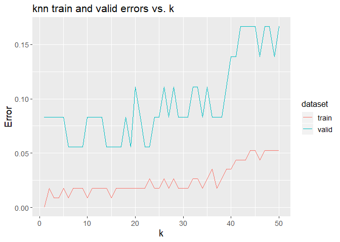
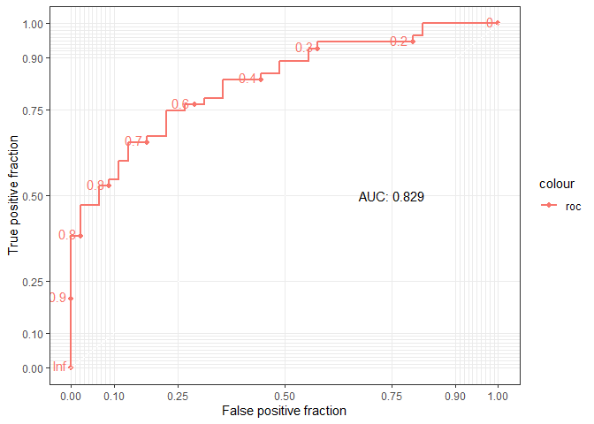

<!-- README.md is generated from README.Rmd. Please edit that file -->

# RMLViz

<!-- badges: start -->

[](https://github.com/UBC-MDS/RMLViz/actions)
[](https://codecov.io/gh/UBC-MDS/RMLViz)
<!-- badges: end -->

Visualization package for ML models.

> This package contains four functions to allow users to conveniently
> plot various visualizations as well as compare performance of
> different classifier models. The purpose of this package is to reduce
> time spent on developing visualizations and comparing models, to speed
> up the model creation process for data scientists. The four functions
> will perform the following tasks:

> 1.  Compare the performance of various models
> 
> 2.  Plot the confusion matrix based on the input data
> 
> 3.  Plot train/validation errors vs. parameter values
> 
> 4.  Plot the ROC curve and calculate the AUC

| Contributors  | GitHub Handle                                   |
| ------------- | ----------------------------------------------- |
| Anas Muhammad | [anasm-17](https://github.com/anasm-17)         |
| Tao Huang     | [taohuang-ubc](https://github.com/taohuang-ubc) |
| Fanli Zhou    | [flizhou](https://github.com/flizhou)           |
| Mike Chen     | [miketianchen](https://github.com/miketianchen) |

## Installation

You can install RMLViz from [GitHub](https://github.com/) with:

    # install.packages("devtools")
    devtools::install_github("UBC-MDS/RMLViz")

## Functions

| Function Name             | Input                                                                      | Output                                                                  | Description                                                                                                                                                                                                 |
| ------------------------- | -------------------------------------------------------------------------- | ----------------------------------------------------------------------- | ----------------------------------------------------------------------------------------------------------------------------------------------------------------------------------------------------------- |
| model\_comparison\_table  | train\_data, test\_data, …                                                 | Dataframe of model score                                                | Takes in training data, testing data, with the target as the last column and fitted models with meaningful names then outputs a table comparing the scores for different models.                            |
| confusion\_matrix         | actual\_y, predicted\_y, labels, title                                     | Confusion Matrix Plot, Dataframe of various scores (Recall, F1 and etc) | Takes in a trained model with X and y values to produce a confusion matrix visual. If predicted\_y array is passed in,other evaluation scoring metrics such as Recall, and precision will also be produced. |
| plot\_train\_valid\_error | model\_name, X\_train, y\_train, X\_test, y\_test, param\_name, param\_vec | Train/validation errors vs. parameter values plot                       | Takes in a model name, train/validation data sets, a parameter name and a vector of parameter values to try and then plots train/validation errors vs. parameter values.                                    |
| plot\_roc                 | y\_label, predict\_proba                                                   | ROC plot                                                                | Takes in a vector of prediction labels and a vector of prediction probabilities and plots the ROC curve. The ROC curve also produces AUC score.                                                             |

## Alignment with R Ecosystems

For all of our functions, there are not existing packages that implement
the exact same functionality in R. Most of these functions helps to show
insights about machine learning models conveniently.

## Dependencies

R version \>= 3.6.1 and R packages:

  - vctrs \>= 0.2.0
  - lifecycle \>= 0.1.0
  - pillar \>= 1.4.2
  - dplyr \>= 0.8.3
  - tidyr \>= 1.0.0
  - magrittr \>= 1.5
  - ggplot2 \>= 3.2.1
  - broom \>= 0.5.2
  - pls \>= 2.7.2
  - covr \>= 3.4.0
  - gbm \>= 2.1.5
  - tibble \>= 2.1.3
  - testthat \>= 2.3.1
  - purrr \>= 0.3.3
  - pROC \>= 1.16.1
  - plotROC \>= 2.2.1
  - datasets \>= 3.6.1
  - class \>= 7.3.15
  - rpart \>= 4.1.15
  - randomForest \>= 4.6.14
  - e1071 \>= 1.7.3
  - mlbench \>= 2.1.1
  - caTools \>= 1.17.1.3
  - caret \>= 6.0.85

## Usage and example

1.  `model_comparison_table`

<!-- end list -->

``` r
library(RMLViz)
library(mlbench)
data(Sonar)

toy_classification_data <- dplyr::select(dplyr::as_tibble(Sonar), V1, V2, V3, V4, V5, Class)

train_ind <- caret::createDataPartition(toy_classification_data$Class, p=0.9, list=F)

train_set_cf <- toy_classification_data[train_ind, ]
test_set_cf <- toy_classification_data[-train_ind, ]

## classification models setup
gbm <- caret::train(Class~., train_set_cf, method="gbm", verbose=F)
lm_cf <- caret::train(Class~., train_set_cf, method="LogitBoost", verbose=F)

model_comparison_table(train_set_cf, test_set_cf,
                       gbm_mod=gbm, log_mod = lm_cf)
#> # A tibble: 2 x 5
#>   model   train_Accuracy train_Kappa test_Accuracy test_Kappa
#>   <chr>            <dbl>       <dbl>         <dbl>      <dbl>
#> 1 gbm_mod          0.771       0.540          0.45     -0.146
#> 2 log_mod          0.814       0.623          0.45     -0.170
```

2.  `confusion_matrix`

<!-- end list -->

``` r
library(RMLViz)
data(iris)

set.seed(123)
split <- caTools::sample.split(iris$Species, SplitRatio = 0.75)

training_set <- subset(iris, split == TRUE)
valid_set <- subset(iris, split == FALSE)

X_train <- training_set[, -5]
y_train <- training_set[, 5]
X_valid <- valid_set[, -5]
y_valid <- valid_set[, 5]

predict <- class::knn(X_train, X_train, y_train, k = 5)

confusion_matrix(y_train, predict)
```


    #>                   Sensitivity Specificity Pos Pred Value Neg Pred Value
    #> Class: setosa       1.0000000   1.0000000           1.00       1.000000
    #> Class: versicolor   0.9473684   1.0000000           1.00       0.974359
    #> Class: virginica    1.0000000   0.9736842           0.95       1.000000
    #>                   Precision    Recall       F1 Prevalence Detection Rate
    #> Class: setosa          1.00 1.0000000 1.000000  0.3333333      0.3333333
    #> Class: versicolor      1.00 0.9473684 0.972973  0.3333333      0.3157895
    #> Class: virginica       0.95 1.0000000 0.974359  0.3333333      0.3333333
    #>                   Detection Prevalence Balanced Accuracy
    #> Class: setosa                0.3333333         1.0000000
    #> Class: versicolor            0.3157895         0.9736842
    #> Class: virginica             0.3508772         0.9868421

3.  `plot_train_valid_error`

<!-- end list -->

``` r
library(RMLViz)
data(iris)

set.seed(123)
split <- caTools::sample.split(iris$Species, SplitRatio = 0.75)

training_set <- subset(iris, split == TRUE)
valid_set <- subset(iris, split == FALSE)

X_train <- training_set[, -5]
y_train <- training_set[, 5]
X_valid <- valid_set[, -5]
y_valid <- valid_set[, 5]

plot_train_valid_error('knn', 
                       X_train, y_train, 
                       X_valid, y_valid, 
                       'k', seq(50))
```



4.  `plot_roc`

<!-- end list -->

``` r
library(RMLViz)
set.seed(420)
num.samples <- 100
weight <- sort(rnorm(n=num.samples, mean=172, sd=29))
obese <- ifelse(test=(runif(n=num.samples) < (rank(weight)/num.samples)),
                yes=1, no=0)

glm.fit=glm(obese ~ weight, family=binomial)
obese_proba <- glm.fit$fitted.values

plot_roc(obese, obese_proba)
```


